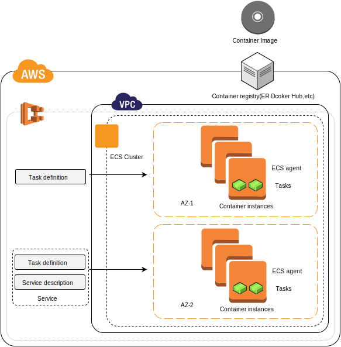

#What is Amazon EC2 Container Service?

Amazon EC2 Container Service(Amazon ECS) はEC2からなるクラスタ上でDockerコンテナを運用するにあたって、簡単に起動、停止が出来、また速さや高い拡張性をもつサービス。

あなたクラスタ上のコンテナを可用性の要件や独立性にしたがって計画的に配置するできる。Amazon ECSはインフラのスケーリングの運用の心配や、クラスタのオペレーションや運用を取り除いてくれる。

Amazon ECSは、管理とスケールバッチとExtracet-Transform-Load(ETL)ワークロードやマイクロサービスモデルの洗練されたアプリケーション設計の構築を一貫としたデプロイメントとbuildで実現し利用できる。より詳細なECSの使用例とシナリオは[Container Use Cases](https://aws.amazon.com/containers/use-cases/)を参照。
 
AWS Elastic Beanstalk もあなたのアプリケーションのインフラの他のコンポーネントと連動してDockerコンテナの速い開発、テスト、とデプロイを行うことが出来る。しかしながら、Amazon ECSはより直接に粒度の高いコントロールと対応を提供する。Beanstalkについては[AWS Elastic Beanstalk Developer Guide](http://docs.aws.amazon.com/elasticbeanstalk/latest/dg/)を参照。

##Features of Amazon ECS

Amazon ECS は一つのリージョン内のマルチAZにわたる高い可用手法のアプリケーションコンテナを起動するために簡素化したリージョン依存のサービス。すでにあるVPC、また新しいVPCをにECSを作ることが出来る。特定のDockerimageから作られたクラスタを起動した後にtask definitionsとサービスを設定することが出来る。コンテナイメージはAWS環境内や外のコンテナリポジトリに保存やpullする。

